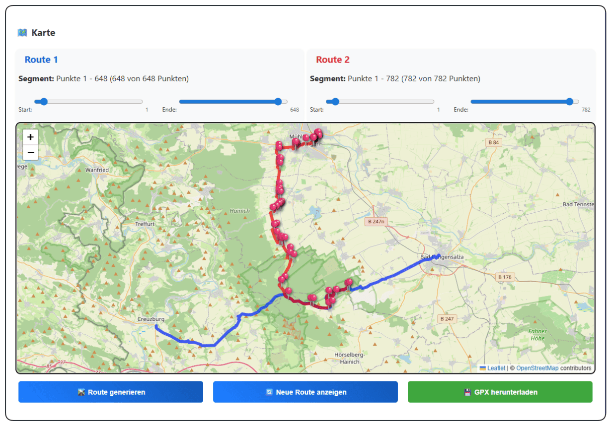

# GPX-kombinieren-Editor

Der **GPX-kombinieren-Editor** ist eine Webanwendung zum Laden, Prüfen, Kombinieren und Exportieren von zwei GPX-Strecken.  
Die App richtet sich an Nutzer, die vorhandene Routen zusammenführen, Teilabschnitte auswählen und zusätzliche Wegpunkte direkt auf der Karte bearbeiten möchten.

## Funktionsweise der App

### 1. Zwei GPX-Dateien laden
Oben können zwei GPX-Dateien per **Drag & Drop** oder per Klick geladen werden.

- **Route 1** wird als blaue Strecke verwendet
- **Route 2** wird als rote Strecke verwendet

Zusätzlich können über den Button **„Demo-Strecken laden“** zwei Beispielrouten geladen werden.

## 2. Strecken auf der Karte prüfen
Nach dem Laden werden beide Routen auf der Karte angezeigt.

Dabei sieht man sofort:

- Verlauf der beiden Strecken
- Wegpunkte aus den GPX-Dateien
- räumliche Überschneidungen
- Start- und Endbereiche

So lässt sich schnell erkennen, welche Abschnitte übernommen werden sollen.

## 3. Segmente auswählen
Für jede Route gibt es oberhalb der Karte zwei Schieberegler:

- **Start**
- **Ende**

Damit kann für jede GPX-Datei genau festgelegt werden, **welcher Abschnitt verwendet werden soll**.

Beispiel:
- von Route 1 nur der erste Teil
- von Route 2 nur der mittlere oder letzte Teil

Die Auswahl wird direkt auf der Karte sichtbar.

## 4. Neue Route erzeugen
Mit dem Button **„Route generieren“** erstellt die App aus den gewählten Teilstücken eine neue kombinierte Route.

Die Anwendung verbindet die ausgewählten Segmente zu einer neuen GPX-Strecke, die anschließend geprüft und exportiert werden kann.

## 5. Neue Route anzeigen
Mit **„Neue Route anzeigen“** kann zwischen der ursprünglichen Darstellung und der neu erzeugten Route umgeschaltet werden.

Das ist hilfreich, um das Ergebnis direkt mit den Originalrouten zu vergleichen.

## 6. Wegpunkte bearbeiten
Unterhalb der Karte können Wegpunkte ergänzt oder verändert werden.

Möglich sind unter anderem:

- Name
- Beschreibung
- Link
- Symbol
- Typ
- Koordinaten
- Höhe

Wegpunkte können:

- manuell eingetragen
- aus GPX-Dateien übernommen
- auf der Karte verschoben
- auf die Route angepasst
- bearbeitet oder gelöscht werden

## 7. GPX-Ausgabe und Export
Im unteren Bereich wird die neu erzeugte GPX-Datei als Text angezeigt.

Mit **„GPX herunterladen“** kann das Ergebnis als Datei gespeichert werden.

Damit lässt sich die kombinierte Route anschließend in anderen Programmen, Apps oder Navigationssystemen weiterverwenden.

## Typischer Ablauf

1. Zwei GPX-Dateien laden  
2. Strecken auf der Karte vergleichen  
3. Start- und Endpunkte je Route festlegen  
4. Neue Route generieren  
5. Wegpunkte ergänzen oder korrigieren  
6. GPX-Datei herunterladen  

## Einsatzmöglichkeiten

Die App eignet sich zum Beispiel für:

- Zusammenführen von Hin- und Rückweg
- Kombinieren mehrerer Teilstrecken
- Aufbereiten von Fahrradrouten
- Ergänzen von Wegpunkten mit Informationen
- Vorbereiten einer GPX-Datei für Navigation oder Archiv

## Technik

Die Anwendung basiert auf:

- HTML
- CSS
- JavaScript
- Leaflet
- GPX-Verarbeitung im Browser

## Lizenz

Dieses Projekt steht unter der in `LICENSE.md` beschriebenen Lizenz.
